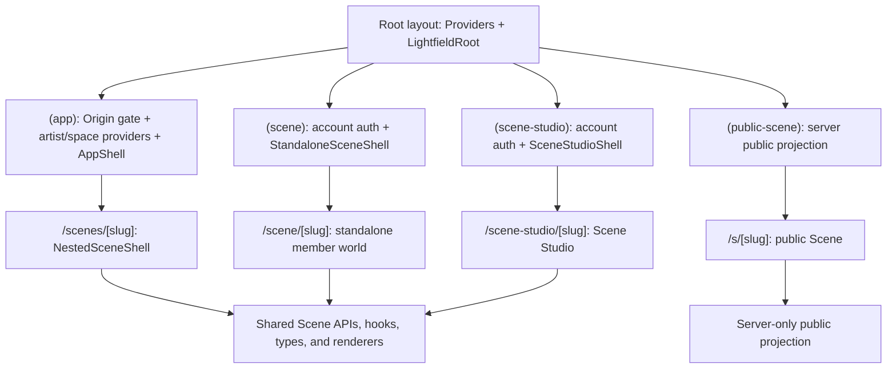

# TEMPO Scenes V2 — Technical Design

*Implementation contract for the full-network Scenes release. Additive
migrations only. Never reset or recreate the live database.*

## 1. Current constraints and chosen approach

Scenes v1 lives under `app/(app)` and therefore inherits the Origin gate,
active artist, active space, app shell, and artist theme. Its ownership,
membership, post authorship, invitations, and chat rendering use
`artist_profiles`. Those dependencies prevent a non-artist account from
operating a Scene.

V2 introduces an account-owned Scene persona and a standalone route group,
while preserving every v1 row and route during migration.

### Invariants

- `auth.users.id` is the authorization identity.
- A `scene_persona` is the presentation identity inside one Scene.
- `artist_profile_id` is optional presentation context, never the permission gate.
- Client reads and writes continue through Supabase with RLS unless a public
  projection or privileged server action is explicitly required.
- Public routes use server-only code and `Cache-Control: no-store` for
  personalized or signed-media responses.
- The private `audio` storage bucket remains the only bucket.

## 2. Route and provider architecture



Create `app/(scene-studio)/layout.tsx` with a server auth check and
`SceneStudioShell`. It must not import `ActiveArtistProvider`,
`ActiveSpaceProvider`, `ArtistThemeProvider`, `GlobalPlayerProvider`, or the
Origin preflight. Root `Providers` already supplies React Query and toasts.

The nested member route remains under `(app)` and mounts `NestedSceneShell`
inside `AppShell`. Shared renderers accept a `surface: "nested" | "studio" |
"standalone" | "public"` prop only when presentation truly differs; data hooks
never depend on the shell.

Create `app/(scene)/layout.tsx` with account auth and
`StandaloneSceneShell`. `/scene` and `/scene/[slug]` do not mount Origin,
artist, space, artist theme, or global player providers.

Update the authenticated landing resolver and auth callbacks:

- Preserve an allowed relative `next` path through login/registration.
- A Scene invitation returns to its invitation/persona flow after auth.
- A user with no artist but with a Scene membership/ownership lands at `/scene`.
- A user with neither may choose Scene-first setup or artist Origin.
- Origin gates core artist-workspace routes only. It never gates `/scene`,
  `/scene-studio`, or an authenticated Scene invitation.
- Store `tempo`, `scenes`, or `last` as an account home preference; default to
  the only surface the account can currently use.

Middleware adds exact public prefixes `/s`, `/api/s`, and public Scene invite
landing routes. Authenticated Studio remains protected by the existing default
gate.

## 3. Migration sequence

The repository currently reaches migration 059. Scenes V2 starts at 060.
Every file is independently runnable and its UI degrades until that package is
present.

### 060 — account personas and membership identity

Create `scene_personas`:

| Column | Contract |
|---|---|
| `id` | uuid primary key |
| `scene_id` | Scene cascade |
| `user_id` | auth user cascade |
| `artist_profile_id` | nullable link, set null on profile delete |
| `display_name` | 1–80 characters |
| `handle` | nullable, lowercase Scene-local handle |
| `avatar_url` | nullable private storage path |
| `bio` | nullable, max 1,000 |
| `pronouns` | nullable, max 80 |
| `location`, `country_code` | nullable |
| `links` | jsonb array, max 12 |
| `source` | `account`, `artist`, or `invitation` |
| timestamps | created/updated |

Constraints: unique `(scene_id, user_id)` and unique lowercased handle within a
Scene when non-null.

Create `account_surface_preferences`:

| Column | Contract |
|---|---|
| `user_id` | auth user primary key, cascade |
| `home_surface` | `tempo`, `scenes`, or `last`; default `last` |
| `last_scene_id` | nullable Scene, set null on archive/delete |
| timestamps | created/updated |

The row is owned and writable only by its account. When no row exists, the
server chooses the only usable surface; if both are usable, existing accounts
default to TEMPO and Scene-invited accounts return to Scenes.

Alter `scene_members`:

- Add `id uuid default gen_random_uuid()` and make it the primary key.
- Add `persona_id` referencing `scene_personas`.
- Make `profile_id` nullable and retain it as `legacy_profile_id` behavior
  without renaming the column during the compatibility window.
- Add unique `(scene_id, user_id)` after duplicate consolidation.
- Keep `user_id`, role, status, onboarding, read state, points, and timestamps.
- Replace invitation/profile RPC parameters with persona or account IDs.

Backfill one persona per `(scene_id, user_id)` from the strongest existing
membership. If duplicate profile memberships exist, consolidate them in one
transaction using role priority owner → moderator → member and state priority
banned → active → pending → invited → left. A ban must never be weakened by a
second active profile. Preserve the earliest join date, latest read date, union
of completed welcome steps, maximum points/streak, and all moderation history.

Alter `scenes.owner_profile_id` to nullable. `owner_user_id` remains required
and authoritative. Update helpers and policies to use `user_id` and
`persona_id`; keep compatibility wrappers that accept profile IDs until all v1
clients are removed.

Scene-authored entities gain nullable `scene_persona_id`:

- `posts`
- `post_comments`
- `messages`
- event creator metadata
- moderation-log actor snapshots

Backfill from `(scene_id, author_user_id)` or the legacy profile membership.
Render persona first and legacy artist profile second during migration. New
Scene writes require a persona and do not require an artist profile.

### 061 — Sections, groups, and access

Create `scene_sections`:

| Column | Contract |
|---|---|
| `id`, `scene_id` | uuid keys |
| `type` | `discussion`, `chat`, `events`, `library`, `showcase`, `page` |
| `name`, `slug`, `description` | identity |
| `icon` | allowlisted Lucide key, not arbitrary markup |
| `sort_order` | stable integer ordering |
| `post_policy` | `members`, `moderators`, or `owners` |
| `visibility` | `members` or `groups` |
| `config` | typed-per-renderer jsonb, max 32 KB |
| `archived_at`, timestamps | lifecycle |

Constraints: unique active slug per Scene; at most 50 active Sections; a
Section type is immutable after it contains content.

Create `scene_groups`, `scene_group_members`, and `scene_section_groups`.
Groups affect Section visibility only; role authorization remains fixed.
Every access helper is a security-definer function that resolves by
`auth.uid()` without recursively reading an RLS policy.

Backfill:

- Each v1 Scene receives `General` discussion, `Chat`, and `Events` Sections
  based on enabled features.
- Existing `scene_topics` become discussion filters under the General Section;
  they are not converted into top-level Sections automatically.
- Existing Scene conversation and events are assigned to their new Sections.

### 062 — appearance and Scene identity

Add to `scenes`:

- `banner_focal_x`, `banner_focal_y` numeric percentages, default 50
- `banner_alt` text
- `banner_treatment` (`wash`, `cinematic`, `clean`), default `wash`
- `nav_style` reserved to the supported V2 style
- `default_section_id`

These fields land immediately after Sections because the nested shell and
Appearance Studio are the first shared presentation layer. Original media
paths remain unchanged; focal coordinates affect rendering only.

### 063 — Library, Pages, and Showcase

Create:

- `scene_library_collections`: Section, title, description, cover path, order
- `scene_library_items`: collection, kind, title, description, body, URL,
  storage path, media metadata, duration, thumbnail, order, publish/schedule
- `scene_pages`: Section, ordered validated block JSON, draft/published state
- `scene_showcase_items`: Section, persona, title, description, URL or frozen
  attachment snapshot, visibility, moderation state

Library item kinds are `article`, `link`, `file`, `audio`, `video`, `replay`,
and `template`. Video/replay items link or store an allowed private file; V2
does not provide a streaming-video transcoding platform.

Page blocks are a small allowlist: heading, paragraph, image, callout, divider,
button, link list, and embed. Reject unknown block kinds and cap document size.
Do not introduce a rich-text dependency.

### 064 — multi-room chat and Section-aware content

- Add `scene_section_id` to Scene posts, events, and conversations.
- Create one conversation per Chat Section and backfill the v1 Scene chat.
- Add message replies, reactions, image/file attachments, and read cursors per
  Chat Section using existing message/storage patterns.
- Update feed/event APIs to require a Section belonging to the same Scene.
- Keep v1 functions as compatibility wrappers targeting the backfilled default
  Section.

### 065 — recognition, activity, and analytics

Create:

- `scene_badges`
- `scene_badge_awards`
- `scene_point_rules`
- `scene_point_events` with idempotency key
- `scene_activity_daily` aggregate rows

Points are append-only events; `scene_members.points` becomes a maintained
cache. Streaks derive from qualifying activity days. Background aggregation
may run through an explicit scheduled endpoint; all writes are idempotent.

Create manager analytics RPCs returning aggregate numbers only. Analytics
read aggregate activity and membership state; they never inspect private
message bodies or private catalog records.

### 066 — public projection, invitations, and release support

- Add `published_at`, `public_summary`, `rules`, `timezone`, and public Section
  flags to Scenes/Sections.
- Add hashed Scene invitation tokens with expiry, max uses, optional Group,
  optional prefilled persona fields, and revocation.
- Implement a server-only `fetchPublicSceneProjection(slug)` that returns only
  allowlisted fields and published public content.
- Signed media endpoints re-check public/member access before issuing a URL.
- Add final search documents, notification triggers, compatibility redirects,
  and the feature-flag readiness function.

## 4. Permission helpers

Required non-recursive helpers:

- `scene_persona_id(scene_id)`
- `scene_role_of(scene_id)`
- `is_scene_member(scene_id)`
- `is_scene_manager(scene_id)`
- `can_view_scene(scene_id)`
- `can_view_scene_section(section_id)`
- `can_post_to_scene_section(section_id)`
- `can_manage_scene_section(section_id)`
- `can_view_scene_library_item(item_id)`

Helpers use `auth.uid()` and security-definer search paths. Revoke mutation RPCs
from `public` and `anon`; grant narrowly to `authenticated` or `service_role`.

### Access matrix

| Action | Owner | Moderator | Member | Public |
|---|---:|---:|---:|---:|
| View public Scene projection | yes | yes | yes | if published |
| View member Section | yes | yes | if active and group-eligible | no |
| Create/reorder/archive Sections | yes | no | no | no |
| Manage Section content | yes | yes | own content only | no |
| Manage groups and invitations | yes | yes | no | no |
| Change branding/door/publication | yes | no | no | no |
| View aggregate analytics | yes | yes | no | no |
| Transfer ownership/archive | yes | no | no | no |

UI gating mirrors this table but is never the boundary.

## 5. Client modules and query keys

Keep the established `lib/api` → hooks → components layering.

New modules:

- `scene-personas.ts`
- `scene-sections.ts`
- `scene-groups.ts`
- `scene-library.ts`
- `scene-pages.ts`
- `scene-showcase.ts`
- `scene-recognition.ts`
- `scene-analytics.ts`
- `scene-public.ts` (server only)

Query keys:

```text
["scene", slug]
["scene-persona", sceneId]
["scene-sections", sceneId]
["scene-pulse", sceneId]
["scene-section", sectionId]
["scene-discussion", sectionId, filter]
["scene-chat", sectionId]
["scene-events", sectionId, range]
["scene-library", sectionId]
["scene-people", sceneId, filters]
["scene-studio", sceneId, area]
["scene-analytics", sceneId, range]
```

Section reorder, RSVP, reactions, welcome steps, poll votes, and read cursors
use optimistic updates with rollback. Structural deletes, role changes,
publication, and archive wait for server confirmation.

## 6. Pulse aggregation

`scene_pulse(scene_id, persona_id)` returns a bounded response rather than
making the browser join every subsystem:

- featured item
- next two events
- latest eligible discussion/resource/showcase items
- newest eligible members
- onboarding progress
- recently visited Sections
- unread counts by Section

The RPC applies Section access before returning identifiers. It returns no
private catalog rows and never accepts arbitrary user IDs.

## 7. Search, notifications, and realtime

Search indexes a normalized Scene document table or RPC projection containing
only content the caller can view. Group-restricted content is filtered before
ranking. Public search uses a separate public projection.

Realtime subscriptions are scoped by visible Scene/Section IDs. Chat uses one
subscription for the open conversation; navigation badges use compact read
cursors rather than subscribing to every message stream.

Notification triggers set explicit slug-based URLs. Preference resolution is
server-side. Ordinary high-volume chat and feed activity updates unread cursors
without generating one tray row per event.

## 8. Media and appearance data

Banner uploads preserve the original file. Rendering performs responsive CSS
cropping from stored focal coordinates; no destructive server crop is the
source of truth. Appearance Studio previews desktop hero, mobile hero, browse
card, and public page before saving.

Storage paths:

```text
scenes/{scene_id}/identity/{entity_id}/{file}
scenes/{scene_id}/library/{item_id}/{file}
scenes/{scene_id}/chat/{message_id}/{file}
scenes/{scene_id}/pages/{block_id}/{file}
```

Every non-uploader read uses an access-checking signed-media route. Never
return storage service keys or the service-role credential to the client.

## 9. Compatibility and feature gating

`NEXT_PUBLIC_SCENES_V2` controls only routing/presentation. Database policies
must remain correct whether the flag is on or off.

- V1 reads continue through compatibility views/wrappers until final cutover.
- Existing `/scenes/[slug]?tab=events|members|chat|about` links redirect to V2.
- Missing migration packages produce a section-level explanation, not a blank
  page or uncaught error.
- Do not remove v1 columns/functions in the V2 release. Cleanup requires a
  later migration after telemetry confirms no old client is active.

## 10. Technical acceptance gates

- A user with no artist row can create, own, join, post, chat, RSVP, and manage.
- RLS negative tests show zero rows for non-members and wrong-group members.
- Existing artist-linked posts/messages retain correct authors after backfill.
- A public request cannot read member personas, private Sections, or storage.
- Studio routes never mount artist/space providers or trigger Origin.
- Nested and Studio renderers agree on permissions and content state.
- Banner focal coordinates produce stable crops at all documented breakpoints.
- Every migration is rerunnable where `if not exists` is safe and fails loudly
  rather than partially consolidating identity data.
